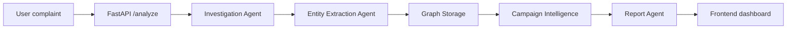

# Sentinel AI

Sentinel AI is a fraud-analysis platform for suspicious cybercrime complaints. It combines a FastAPI backend, a LangGraph pipeline, and a React + Vite frontend to turn a free-form message into structured intelligence, extracted entities, and a reusable complaint graph.

## What It Does

The system is built to help you:

- analyze a suspicious message or complaint
- identify the scam pattern and explain why it looks suspicious
- extract entities such as phone numbers, UPI IDs, email addresses, URLs, bank accounts, and authorities
- persist complaint data into a graph-friendly store for future matching
- compare a new complaint against earlier complaints to spot related activity
- generate a concise intelligence report from the combined findings

## How It Works



The backend sends each complaint through this sequence:

1. Investigation agent: summarizes the scam, explains the risk, and suggests immediate actions.
2. Entity extraction agent: pulls structured indicators from the message.
3. Graph node: stores the complaint in `backend/data/complaints.json`.
4. Campaign intelligence agent: searches for related complaints using shared entities.
5. Report agent: produces the final JSON intelligence report.

## Project Structure

```text
sentinel-ai/
  backend/
    main.py                FastAPI app and API routes
    llm.py                 Groq-backed LLM client
    agents/                Prompt-driven analysis agents
    graph/                 LangGraph workflow and shared state
    graph_db/              Complaint storage and graph matching
    utils/                 JSON parsing helper
    data/complaints.json   Persistent complaint dataset
  frontend/
    src/                   React UI
    public/                Static frontend assets
    package.json           Frontend scripts and dependencies
  assets/                  Project assets placeholder
  docs/                    Documentation placeholder
```

## Backend Overview

The backend exposes a small API:

- `GET /` - health check
- `POST /analyze` - runs the full complaint analysis workflow
- `POST /crisis` - generates a safety-oriented follow-up response from a prior analysis and user reply

The main orchestration lives in `backend/graph/workflow.py`, which composes the nodes defined in `backend/graph/nodes.py`.

### Backend Dependencies

The backend code imports the following direct Python packages:

- `fastapi`
- `uvicorn`
- `pydantic`
- `python-dotenv`
- `langchain-groq`
- `langgraph`
- `networkx`

## Frontend Overview

The frontend is a simple React + TypeScript dashboard built with Vite. It lets a user paste a suspicious message, sends it to `POST /analyze`, and renders the returned JSON in separate sections for investigation, entities, intelligence, and report output.

Frontend scripts are defined in `frontend/package.json`:

- `npm run dev` - start the Vite dev server
- `npm run build` - type-check and build for production
- `npm run lint` - run ESLint
- `npm run preview` - preview the production build

## Prerequisites

- Python installed locally
- Node.js and npm installed locally
- A Groq API key available as `GROQ_API_KEY`

## Setup

### 1. Backend

From the `backend` folder:

```bash
python -m venv .venv
.venv\Scripts\activate
pip install fastapi uvicorn pydantic python-dotenv langchain-groq langgraph networkx
uvicorn main:app --reload
```

The backend expects `GROQ_API_KEY` to be available in `backend/.env` or your active shell environment.

### 2. Frontend

From the `frontend` folder:

```bash
npm install
npm run dev
```

The UI expects the backend to be running at `http://127.0.0.1:8000`.

## Usage

1. Start the backend.
2. Start the frontend.
3. Open the Vite app in your browser.
4. Paste a suspicious message into the analysis box.
5. Review the extracted entities, campaign intelligence, and final report.

## Example Input

The system is designed for text such as:

- fake government officer scams
- urgent transfer requests
- UPI payment fraud messages
- phishing links or contact details
- repeated complaint patterns across multiple victims

## Notes

- Complaint records are appended to `backend/data/complaints.json`.
- Entity matching is based on shared values across complaints, not on a full graph database server.
- The frontend currently posts directly to `http://127.0.0.1:8000/analyze`, so the backend origin must stay aligned with the CORS settings in `backend/main.py`.
- `assets/` and `docs/` are currently empty placeholders.

## Troubleshooting

- If the frontend cannot reach the backend, confirm that `uvicorn main:app --reload` is running from the `backend` directory.
- If requests fail with an authentication or model error, check that `GROQ_API_KEY` is set correctly.
- If no related complaints are found, the campaign intelligence step will return an empty or low-match result by design.

## Development Tips

- Use `backend/test_graph.py` and `backend/test_graph_db.py` as quick smoke tests for the workflow and complaint matching logic.
- The LLM outputs are parsed as JSON, so prompts are intentionally strict about returning valid JSON only.
